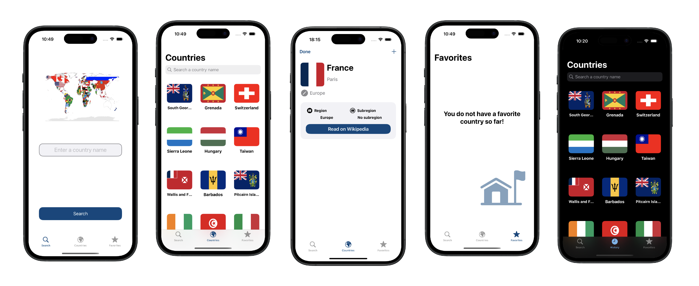

# RCInfo (iOS)

An iOS Swift app that uses the REST Countries API to let users discover, search, and favourite countries.

---

## ✨ App Features
- Browse a clean list of countries with flag thumbnails
- Search with country name
- Add/remove favourites (persisted locally)

---

## 🛠️ Tech Stack
- **Swift 6.1+**, **Xcode 16+**, **iOS 16+**
- **UIKit** for UI
- **MVC** architecture
- **URLSession** + **Codable** for networking/decoding
- **UserDefaults** for persistence(favourites)

---


## 🚀 Getting Started
### Requirements
- Xcode 16 or newer
- iOS 16.2+ target

### Setup
1. **Clone** the repository:
   ```bash
   git clone https://github.com/sh-raz/RCInfo.git
   cd RCInfo
   ls
   ```
2. **Open** `RCInfo.xcodeproj`
3. **Run** on a simulator or device

No keys or secrets needed.

---

## 🌐 API
- Data by **REST Countries** (public API): `https://restcountries.com/`


## 📸 Screenshots
| 

---
## 🎥 Demo
▶️ [Watch the demo](docs/RCInfo demo.mp4)


---

## 🤝 Contributing
1. Fork the repo
2. Create a feature branch: `git switch -c featureName`
3. Commit: `git commit -m "commit message"`
4. Push: `git push -u origin featureName`
5. Open a Pull Request


